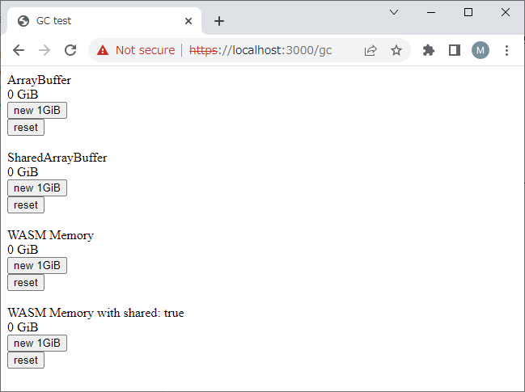

# GC Test

Test GC for [issue1414681](https://bugs.chromium.org/p/chromium/issues/detail?id=1414681) in chromium

## Prepare server

~~~ bash
$ cd ua-server
$ npm i
$ npm run keygen
 :
Country Name (2 letter code) [AU]:
State or Province Name (full name) [Some-State]:
Locality Name (eg, city) []:
Organization Name (eg, company) [Internet Widgits Pty Ltd]:
Organizational Unit Name (eg, section) []:
Common Name (e.g. server FQDN or YOUR name) []:
Email Address []:
$ npm start
 :
Listening on port 3000
~~~

## Test by Chrome

On the Windows 10, Chrome Version 110.0.5481.97 (Official Build) (64-bit)  
Please ignore the cert error.

Open https://localhost:3000/gc  

The chrome can allocate following buffers around 16GiB in total.

- ArrayBuffer
- SharedArrayBuffer
- WASM Memory

However, the WASM Memory with shared:true option, chrome cannot release the memory
correctly. And this causes fatal OOM error.

This is an example video.

<video controls src="./images/gcTest.mp4" muted="false"></video></div
